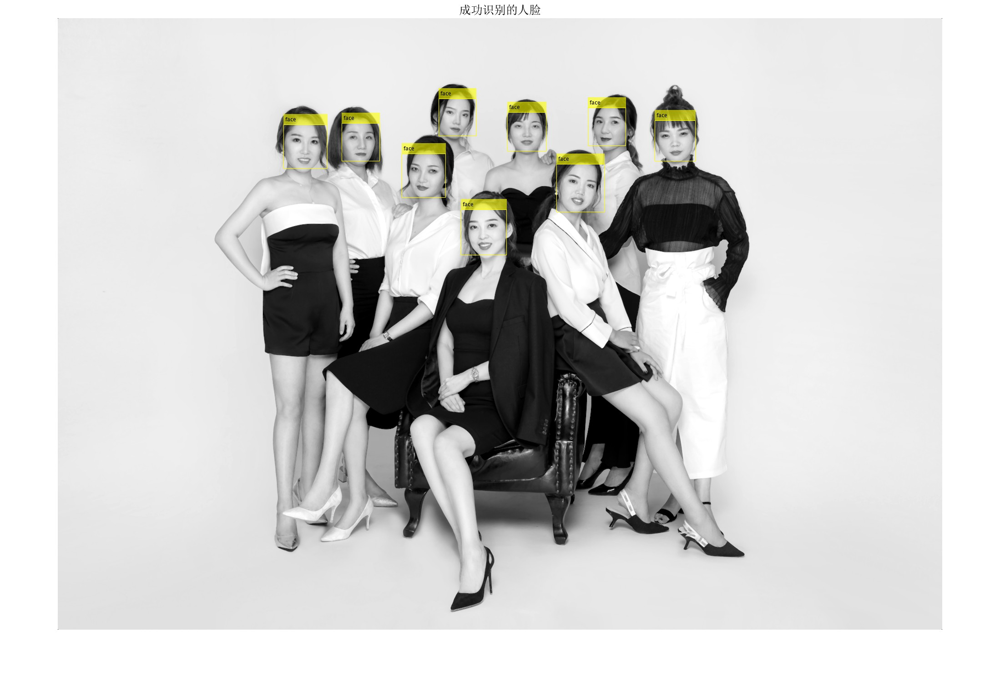
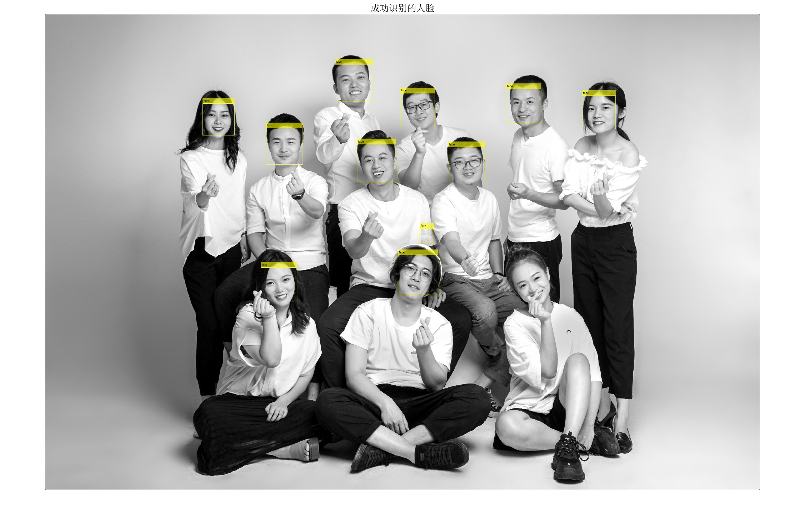
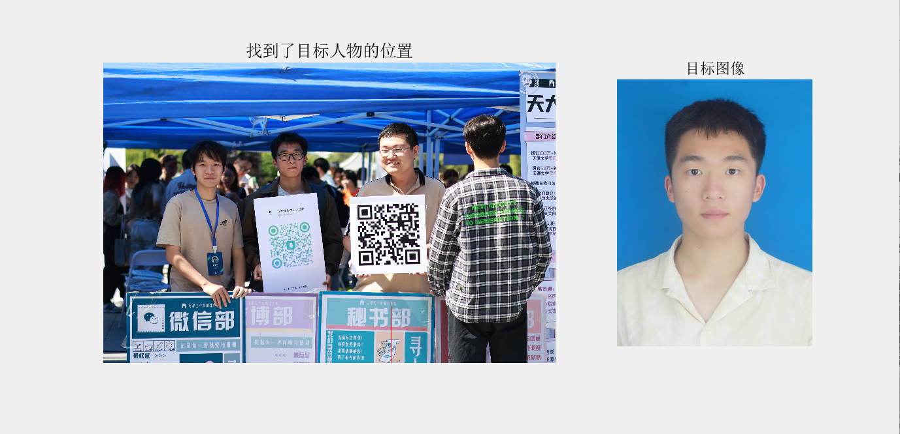

# 基于 MATLAB 的人脸检测和识别方法

本文介绍了一种基于 MATLAB 实现人脸检测和人脸识别的方法，包括图像预处理、人脸检测、人脸识别及模型检验和拓展。

## 1. 图像预处理
```matlab
% 读取输入图像
inputImage = imread('16.png'); 
figure;imshow(inputImage);title("原图")
pause(1);

%转化为灰度图像
inputImage = rgb2gray(inputImage);
figure;imshow(inputImage);title("灰度图像")
pause(1);

% 增强对比度
inputImage = imadjust(inputImage);
figure;imshow(inputImage);title("增强对比度")
pause(1);
```
对图像进行预处理，包括以下步骤：

1. 使用 `rgb2gray()` 函数将图片转换为灰度图像。

2. 使用 `imadjust()` 函数提高图像的对比度。

3. 使用 `medfilt2()` 函数进行均值滤波以降噪。


## 2. 人脸检测

使用计算机视觉处理工具箱中的预训练人脸检测器进行人脸检测。`vision.CascadeObjectDetector()` 是图像处理工具箱（IPT）中自动配置的视觉检测器，广泛用于人脸检测、物品监视、计算机视觉等领域。基于级联分类器算法，它能够提供精确的检测结果。
```matlab
% 创建人脸检测器
faceDetector = vision.CascadeObjectDetector();
faceDetector.MinSize = [30 30]; % 调整最小检测尺寸
faceDetector.ScaleFactor = 1.1; % 调整检测尺度因子

% 检测图像中的人脸
bbox = step(faceDetector, inputImage);

% 绘制检测到的人脸区域
IFaces = insertObjectAnnotation(inputImage, 'rectangle', bbox, 'face');
figure;
imshow(IFaces);
title('成功识别的人脸');
```
- 建立人脸检测器，并调整合适的参数以精确检测人脸区域。
- 在检测到的人脸区域绘制矩形框进行标记(结果如图)


## 3. 进阶操作：检测合照中的所有人脸

传统的人脸检测方法主要基于面部连通域特征来捕捉人脸，但在合照中，连通域的重叠可能导致传统方法误判。因此，使用预训练好的分类器能够更准确地检测到所有人脸。

- 重复前述的预处理和人脸检测操作。
- 确保检测到所有人脸并在合照中标记出每个人脸的区域。

## 4. 进阶操作：人脸识别

使用 `imread()` 读取合照大图和截取的人脸模板图像。利用 `subplot()` 函数将两张图像并置，以便于比较。对图片进行灰度转换、对比度增强和均值滤波处理。

1. 使用 `normxcorr2()` 函数进行模板匹配，计算模板图像与大图之间的归一化互相关，并返回相关图（`correlationMap`）。
2. 通过查找相关图中的最大值，确定模板图像在大图中的匹配位置：

    ```matlab
    correlationMap = normxcorr2(templateImageGray, largeImageGray);
    [maxCorr, maxIdx] = max(abs(correlationMap(:)));
    [y, x] = ind2sub(size(correlationMap), maxIdx);
    ```

3. 计算匹配位置的偏移量，并使用 `insertShape()` 函数在大图中标记匹配位置。匹配结果如图：


## 5. 模型的检验和拓展

- 使用 `14.png` 进行多人脸识别，发现被手指遮挡的人脸无法被识别（如图所示）。

- 对同一个人物而言，使用该人物的正脸照片去寻找合照中的人物会发生错误。(没有找到目标人物并框出来)着说明基于传统图形学的人脸识别灵敏度和准确度不高。

    **综上所述，此方法面对不同环境下的人脸有着局限性**